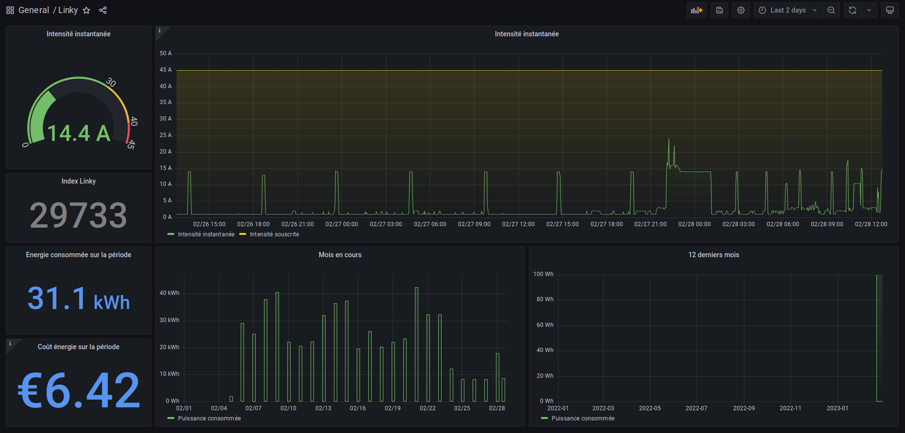

Téléinfo Linky
==============



__Téléinfo Linky__ récupère les données de téléinformation client (TIC) du compteur Linky sur un Raspberry Pi. Les données sont envoyées vers un bucket InfluxDB pour stockage. La visualisation peut s'effectuer directement sous InfluxDB ou avec un autre outil comme Grafana.

Ce dépôt comprend :
* le script Python pour lire les données de téléinformation via le port série du Raspberry Pi
* un service Systemd pour lancer le script automatiquement
* un tableau de bord Grafana


Pré-requis
----------

* Raspberry Pi (ou tout autre système Linux disposant d'un port série)
* Module électronique pour la connexion entre le Linky et le port GPIO du Pi
* InfluxDB et Grafana (hors cadre de ce tutoriel)

Testé avec un Raspberry Pi Zero W (Raspbian 11) et le module [PITInfo](https://www.tindie.com/products/Hallard/pitinfo/) (~10€)

Je recommande d'utiliser l'UART PL011 via `/dev/ttyAMA0` car le comportement de `/dev/ttyS0` est plus erratique. Voir la section Activation de l'UART PL011 sur Raspberry Pi Zero en bas de page.


Test téléinformation
--------------------

Vérification que l'utilisateur est bien dans le groupe `dialout` pour pouvoir accéder au port série :

    $ groups

Si ce n'est pas le cas, ajout de l'utilisateur au groupe `dialout` (n'oubliez pas le `-a`). Note : vous devez vous déconnecter de votre session puis vous reconnecter pour que les droits prennent effet.

    $ sudo usermod -a -G dialout $USER

Une fois le Rasperry Pi connecté au Linky via le module PITInfo, il est possible de vérifier que la téléinfo est bien reçue sur le port série grâce à `screen`:

Si `screen` n'est pas installé, `sudo apt update && sudo apt install screen`

* TIC mode historique (par défaut)

    $ screen /dev/ttyAMA0 1200,cs7

* TIC mode standard

    $ screen /dev/ttyAMA0 9600,cs7,parenb,-parodd,-cstopb


Vous devez recevoir en boucle des informations qui ressemblent à cela :

```
MOTDETAT 000000 B
ADCO xxxxxxxxxxxxxx :
OPTARIF BASE 0
ISOUSC 45 ?
BASE 028563823 0
PTEC TH.. $
IINST 003 Z
IMAX 090 H
PAPP 00760 .
HHHCA 
MTDTAT000000 B
```

Pour quitter `screen`, tapez `ctrl-a + k`.

Si cela ne fonctionne pas, inutile d'aller plus loin et vérifiez votre installation.


Installation
------------

Installation des dépendances (`PyYAML`, `pySerial` et `influxdb-client`)

    $ sudo apt update && sudo apt upgrade -y
    $ sudo apt install python3-pip
    $ pip install PyYAML pySerial influxdb-client

Création des répertoires

    $ mkdir ~/linky ~/.config/systemd/user

Copie des fichiers depuis Github

    $ wget -O ~/.config/systemd/user/linky.service https://raw.githubusercontent.com/hleroy/teleinfo-linky/main/linky.service
    $ wget -O ~/linky/linky.py https://raw.githubusercontent.com/hleroy/teleinfo-linky/main/linky.py
    $ wget -O ~/linky/config.yml https://raw.githubusercontent.com/hleroy/teleinfo-linky/main/config.example.yml

Editez le fichier `config.yml` et configurez les paramètres du serveur InfluxDB.

Démarrez le service Linky

    $ systemctl --user daemon-reload
    $ systemctl --user start linky

Vérifiez que le service est bien démarré et qu'il n'y a pas d'erreur dans les journaux

    $ systemctl --user status
    $ journalctl --user-unit linky

Puis activez le service (la deuxième commande permet le démarrage automatique des instances utilisateur de systemd)

    $ systemctl --user enable linky
    $ sudo loginctl enable-linger $USER


Tableau de bord
---------------

Une fois les données dans InfluxDB, la configuration d'un tableau de bord est assez intuitive :


Diverses notes
--------------

Efface toutes les données dans le bucket teleinfo d'InfluxDB

    $ influx delete --bucket teleinfo --start '1970-01-01T00:00:00Z' --stop $(date +"%Y-%m-%dT%H:%M:%SZ")


Activation de l'UART PL011 sur Raspberry Pi Zero
------------------------------------------------

Le Raspberry Pi Zero W contient deux UART pour la communication série, le mini UART (accessible sur `/dev/ttyS0`) et l'UART PL011 (accessible sur `/dev/ttyAMA0`). Ce dernier est un _vrai_ UART hardware, plus performant que le mini-UART. Par défaut, il est utilisé par le module Bluetooth. Pour l'utiliser pour la communication série, il faut :
* Activer l'UART
* Désactiver le Bluetooth
* Désactiver le port console sur l'interface série

Ajouter à la fin de `/boot/config.txt`

```
# Enable UART
enable_uart=1

# Disable Bluetooth
dtoverlay=disable-bt
```

Editer `/boot/cmdline.txt` et retirer `console=serial0,115200`

Désactiver les services Bluetooth
    $ sudo systemctl disable hciuart
    $ sudo systemctl disable bluetooth.service

Redémarrez.


Changelog
=========

## [1.0.0] - 2023-02-28

- Version initiale
                     

Copyright et license
====================

Téléinfo Linky est publié sous licence [GNU General Public License v3.0](COPYING) (GPL-3.0-or-later).

Copyright © 2023 Hervé Le Roy – hleroy@hleroy.com

This program is free software: you can redistribute it and/or modify
it under the terms of the GNU General Public License as published by
the Free Software Foundation, either version 3 of the License, or
(at your option) any later version.

This program is distributed in the hope that it will be useful,
but WITHOUT ANY WARRANTY; without even the implied warranty of
MERCHANTABILITY or FITNESS FOR A PARTICULAR PURPOSE.  See the
GNU General Public License for more details.

You should have received a copy of the GNU General Public License
along with this program.  If not, see <https://www.gnu.org/licenses/>.
